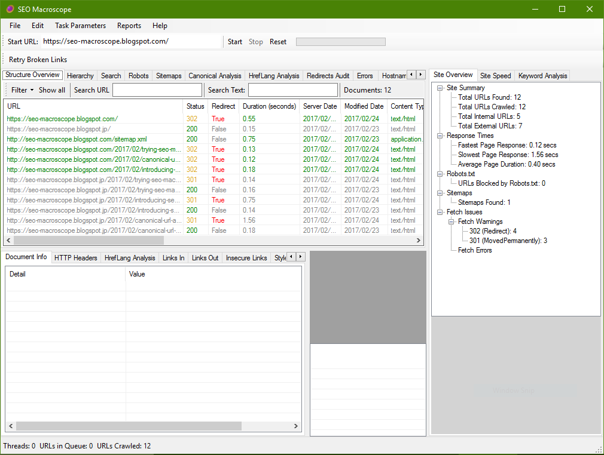

# SEO MACROSCOPE

**This project is still very much under development, expect bugs and unimplemented features.**

## SYNOPSIS

**SEO Macroscope** for Microsoft Windows is a website link checking and scanning tool, with some technical SEO functionality.

## INSTALLATION

The most recent installer may be found under the project releases area on GitHub at:

> [https://github.com/nazuke/SEOMacroscope/releases](https://github.com/nazuke/SEOMacroscope/releases)

The C# solution itself may be opened and run using SharpDevelop 5 or Visual Studio; it may also compile and run using MonoDevelop.

Open the solution in SharpDevelop or Visual Studio, ensure that the references are satisfied, set build to **Debug**, compile and run.

## USAGE

Enter the URL of the website to scan into the **Start URL** field, and then click the **Start** button.

Depending on the size and responsiveness of your website, it may take a while to complete the scan.

## FEATURES

There are still going to be many bugs in this version, and many features and functions remain to be implemented.

However, this beta version is functional enough to be used for many link checking tasks right now.

### Basic functionality includes:

* Scanning all links on one or more websites.
* Reporting broken, redirected, and other types of issues.
* Reporting metadata about each found URL.
* Generating an HrefLang Matrix, for multilingual websites.
* Isolating scans to URL subsets.
* Extraction and report of telephone number and email links.

### SEO functionality includes:

* Set and report acceptable word, character, and pixel lengths for titles.
* Set and report acceptable word, character lengths for descriptions.
* Report on titles, descriptions, keywords, and headings.
* Optionally generate keyword occurrences across pages and the entire site.
* Scan and extract metadata for PDFs.

### Reports may be exported to Excel format. Currently, these include:

* A scan overview.
* An HrefLang Matrix of multilingual sites.
* Page contents, including titles, descriptions, keywords, and headings.

More functionality will be added in the future.
