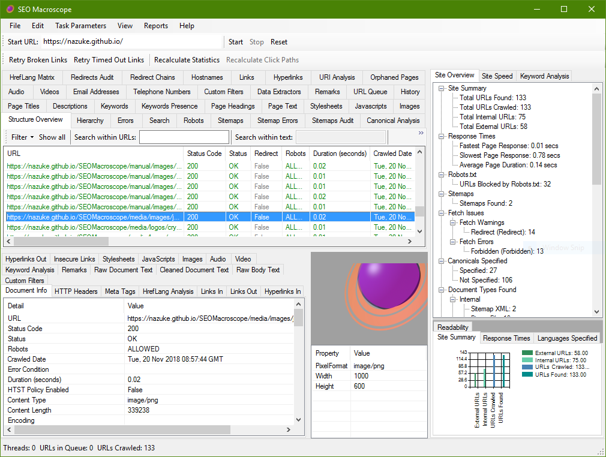

# SEO MACROSCOPE 

**This project is under continuous development, expect bugs and unimplemented features.**

## SYNOPSIS

**SEO Macroscope** for Microsoft Windows is a free and open source website broken link checking and scanning tool, with some technical SEO functionality.

More information about how SEO Macroscope may be used for everyday tasks may be found in the blog at [https://nazuke.github.io/SEOMacroscope/blog/](https://nazuke.github.io/SEOMacroscope/blog/).

## INSTALLATION

The most recent installer may be found under the project releases area on GitHub at:

> [https://github.com/nazuke/SEOMacroscope/releases](https://github.com/nazuke/SEOMacroscope/releases)

It is highly recommended to uninstall the previous version of SEO Macroscope before installing a newer version.

The C# solution is now being developed with Visual Studio 2017.

Open the solution in Visual Studio 2017 or later, ensure that the references are satisfied, set build to **Debug**, compile and run.

## USAGE

Enter the URL of the website to scan into the **Start URL** field, and then click the **Start** button.

Depending on the size and responsiveness of your website, it may take a while to complete the scan.

## FEATURES

There are still going to be many bugs in this version, and many features and functions remain to be implemented.

However, it is functional enough to be used for many link checking tasks right now.

### Basic functionality includes:

* Scanning all links on one or more websites.
* Reporting broken, redirected, and other types of issues.
* Reporting metadata about each found URL.
* Generating an HrefLang Matrix, for multilingual websites.
* Isolating scans to URL subsets.
* Extraction and reporting of telephone number and email links.

### SEO functionality includes:

* Set and report acceptable word, character, and pixel lengths for titles.
* Set and report acceptable word, character lengths for descriptions.
* Report on titles, descriptions, keywords, and headings.
* Optionally generate keyword occurrences across pages and the entire site.
* Scan and extract metadata from PDFs.
* Custom filters to identify content that is missing/present.
* Data extractors to scrape arbitrary content from pages.

### Reports may be exported to Excel format. Currently, these include:

* A scan overview.
* An HrefLang Matrix of multilingual sites.
* Page contents, including titles, descriptions, keywords, and headings.
* Broken links.
* URI Analysis of the pages crawled.
* Reporting of duplicate content, including duplicate titles, checksums, ETags, and a Fastenshtein method.
* Reporting of custom filtered results.
* Reporting of scraped data.

More functionality will be added in the future.

## CREDITS

This project was made a lot easier by the following excellent libraries:

* http://htmlagilitypack.codeplex.com/
* https://bitbucket.org/cagdas/robotstxt
* https://github.com/TylerBrinks/ExCSS
* https://github.com/ClosedXML/ClosedXML
* https://github.com/JoshClose/CsvHelper
* https://github.com/pdonald/language-detection
* https://github.com/DanHarltey/Fastenshtein
* https://itextpdf.com/

For HTTP testing, the httpbin suite was very useful:

* https://github.com/Runscope/httpbin
