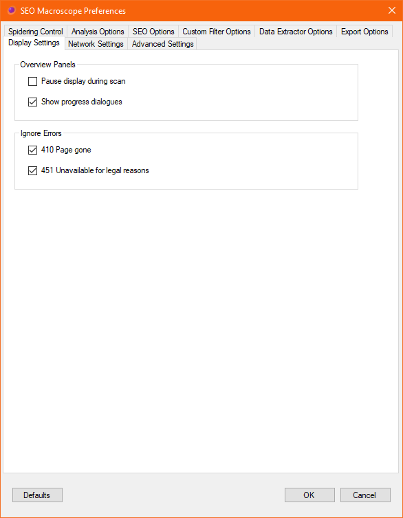
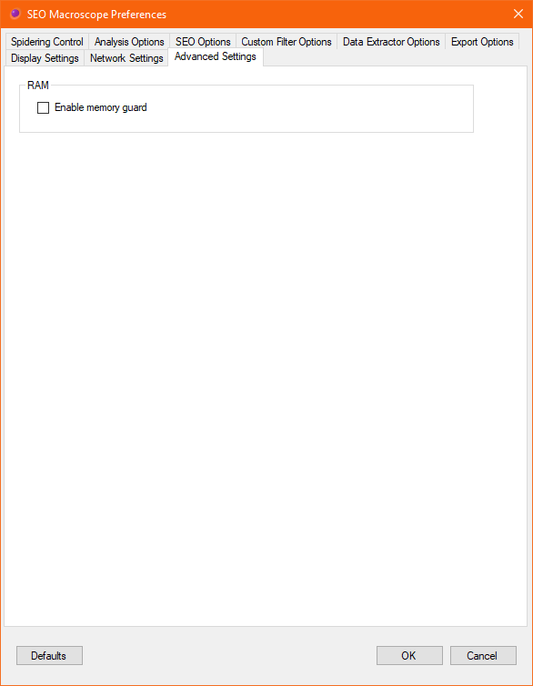

{: .img-responsive .box-shadow .screenshot}

<!-- *********************************************************************** -->

## Help Contents
{:.no_toc}

* TOC
{:toc}

<!-- *********************************************************************** -->

## Getting Started

To run a link scan of a website, simply enter a valid URL into the **Start URL** field, and click **Start**.
{:.lead}

The running scan may be stopped at any time by clicking **Stop**. It may be resumed again by clicking **Start**.

To clear the results of a full or partial scan, click **Reset**.



<!-- *********************************************************************** -->

## File Menu

Export sitemaps in text and XML formats, and list views to CSV and Excel files.

### Load Lists

A list of URLs to be scanned may be either loaded from a text file, or pasted from the clipboard. The scanning process is the same for either method.

### Export Sitemaps

The crawled results may be exported to XML or Text format sitemap files.

### Export Reports

The currently viewed list may be exported to CSV or Excel format files. This option is most useful for those list views that do not have their own report option, such as the search results list.



<!-- *********************************************************************** -->

## Preferences Menu

The default preferences are set to enable modest spidering of your site, but will omit attempting to download large files, will not descend into localized pages, and will not perform some of the more intense SEO analyses.

Some expensive processing options are also disabled by default, such as deep keyword analysis. Check these options, as some of them need to be enabled before crawling takes place.

Please refer to the preferences settings before beginning a spidering job.



<!-- ======================================================================= -->

### Spidering Control

These settings control how SEO Macroscope crawls the links on your site.

{: .img-responsive .box-shadow .screenshot}

#### Standards

##### Follow Robots Protocol (Partially implemented)

SEO Macroscope will honour the robots.txt directives, if present. Currently, this includes only those directives for the wildcard user agent.

Currently, on-page robot directives are not implemented.

If present, the *crawl delay* directive will be followed. Please note however that this delay is set per-thread. Which means that if crawling with 4 threads with a delay of 1 second, then your site may receive 4 requests every second. Set the thread count low to begin with.

Also see *Crawl Delay* in the *Spidering Limits* section.

##### Follow Sitemap Links (Partially implemented)

SEO Macroscope will attempt to discover Google Sitemap XML files specified by your website, and follow the links in them.

#### Links

##### Follow Redirects

If this option is checked, then SEO Macroscope will log and follow redirects. External URLs will only be logged.

##### Follow Canonical Links

If this option is checked, then SEO Macroscope will log and follow canonical links, if present. External URLs will only be logged.

##### Follow HrefLang Links

If this option is checked, then SEO Macroscope will log and follow HrefLang links in the head section of HTML pages.

Please note that this will also mark localized hosts as being "internal" hosts.

##### Follow rel="nofollow" Links

If this option is checked, then SEO Macroscope will log and follow HTML links that are set to "nofollow", otherwise, those links will not be crawled.

#### Domain Restrictions

##### Check External Links

If this option is checked, then SEO Macroscope will log and follow links that are on external hosts.

Please note, this may result in an infinite crawl, or may take an extremely long time to complete.

Use the include/exclude *Task Parameters* to explicitly specify which external hosts you may potentially like to crawl.

#### Spidering Limits

These options control how aggressive SEO Macroscope is in its crawling.

Set low values to begin with.

##### Maximum Worker Threads

SEO Macroscope uses a threaded model to manage crawl workers.

To be conservative, set the number of threads to 1 initially.

Please note that the thread count combines with the *Crawl Delay*. The *Crawl Delay* applies to each thread, which means that your site may receive a request equal to the number of threads every *Crawl Delay* second(s).

##### Maximum Page Depth

Counting from the website's document root of /, this is the maximum depth that SEO Macroscope will fetch a particular URL.

##### Maximum Pages To Fetch

This is approximately the maximum number of pages that SEO Macroscope will attempt to fetch.

It may fetch slightly more than this number.

##### Crawl Delay (seconds)

This overrides the *Crawl Delay* that may be set by the robots.txt directives for the website.

If set, then SEO Macroscope will pause after fetching each page in each thread for *Crawl Delay* second(s).

##### Request Timeout (seconds)

Set this to how long before SEO Macroscope should wait for a response from the server.

##### Maximum Fetch Retries

Set this to the number of attempts that SEO Macroscope should make when retrieving a page.

If you have a fast web server, then set this to a reasonably low value. Setting it too high may slow down the overall crawl if your web server is slow to respond.

#### Crawl Link Types

Please note that HTML documents are *always* crawled. Otherwise, to speed things up, we can exclude document types that we are not interested in crawling. In general, excluded document types may still have a HEAD request issued against them, but they will not be downloaded and crawled further.

##### CSS stylesheets

Enabling this option will cause CSS stylesheets to be fetched, and crawled.

Please not that currently, there is partial support for crawling further linked assets, such as background images, within stylesheets.

##### Javascripts

Enabling this option will cause Javascripts to be checked. Beyond that, no further crawling occurs with Javascripts.

##### Images

Enabling this option will cause images to be checked. Beyond that, no further crawling occurs with images.

##### PDFs

Enabling this option will cause PDF files to be checked.

##### Audio files

Enabling this option will cause audio files to be checked. Beyond that, no further crawling occurs with audio files.

##### Video files

Enabling this option will cause video files to be checked. Beyond that, no further crawling occurs with video files.

##### XML files

Enabling this option will cause XML files to be checked, and if applicable, crawled further.

This also includes Google Sitemap XML files. Disabling this option will cause those to not be downloaded and crawled.

##### Binary files

Binary files are any other file type for which no specific handling occurs.

For example, a linked .EXE file will have a HEAD request issued against it, to check that it is not a broken link.



<!-- ======================================================================= -->

### Analysis Options

Set further localization, list processing, and analysis options here.

{: .img-responsive .box-shadow .screenshot }

#### Web Server Options

##### Resolve server IP addresses

If checked, then the remote IP addresses for the host will be resolved and collected. Please note that each host may resolve to multiple IP addresses.

#### Localized Pages

##### Check Linked HrefLang Pages

Enabling this option will perform a simple HEAD request against detected HrefLang tags found in HTML pages.

By itself, this option will not cause SEO Macrosope to recurse into the websites referenced by the HrefLang tags if the referenced websites are considered to be "external."

Enable the *Follow HrefLang Links* option under the *Spidering Control* tab if you would like to also scan the websites referenced by the HrefLang tags.

#### Process Document Types

Please note that HTML documents are *always* crawled.

Otherwise, to speed things up, we can exclude document types that we are not interested in crawling or processing further.

##### CSS stylesheets

Enabling this option will cause CSS stylesheets to be parsed, with some links inside further crawled and processed.

Please not that currently, there is partial support for crawling further linked assets, such as background images, within stylesheets.

##### Javascripts

Enabling this option will cause Javascripts to be downloaded and analyzed.

Beyond that, no further crawling occurs with Javascripts.

##### Images

Enabling this option will cause images to be downloaded and analyzed.

Beyond that, no further crawling occurs with images.

##### PDFs

Enabling this option will cause PDF files to be downloaded, and if possible, processed and analyzed.

If this option is enabled, PDF texts will be processed in the same manner as HTML text, including having their keyword terms analyzed, and Levenshtein processing applied.

This option is off by default. Please note that enabling this option may consume a lot more bandwidth.

##### Audio files

Enabling this option will cause audio files to be downloaded and analyzed.

Beyond that, no further crawling occurs with audio files.

##### Video files

Enabling this option will cause video files to be downloaded and analyzed.

Beyond that, no further crawling occurs with video files.

##### XML files

Enabling this option will cause XML files to be downloaded, analyzed, and if applicable, crawled further.

This also includes Google Sitemap XML files. Disabling this option will cause those to not be downloaded and crawled.

##### Binary files

Binary files are any other file type for which no specific handling occurs.

For example, a linked .EXE file will have a HEAD request issued against it, to check that it is not a broken link, but disabling this option will not download the file itself.

#### List File Processing

##### Scan sites in list

Enabling this option will cause SEO Macroscope to recurse into the websites for each URL in the URL list.

Please note that this may take a long time to complete if there are many websites included in the URL list.

Uncheck this option, if you only need to check the exact URLs in the URL list.

#### Search Index

##### Enable text indexing

If enabled, then text content in HTML pages will be indexed and searchable after a crawl.

##### Case sensitive indexing

If enabled, then text content will indexed and searchable in a case sensitive manner.

#### Page Fault Analysis

##### Warn about insecure links

Enabling this option will report insecure links to pages or resources from secure pages.



<!-- ======================================================================= -->

### SEO Options

Configure SEO policies and analysis options here.

{: .img-responsive .box-shadow .screenshot }

#### Levenshtein Edit Distance Processing

In addition to other methods, I have implemented a [Levenshtein Edit Distance](https://en.wikipedia.org/wiki/Levenshtein_distance) approach for attempting to detect near-duplicate content.

What this means is that for each HTML or PDF document that is fetched, the human-readable text is extracted and cleaned into a sanitized format.

By then applying the Levenshtein algorithm, we can discover pages that have text content that is similar to each other, within a certain threshold.

Please note that applying this method may incur a significant overhead, especially on larger crawls.

##### Enable Levenshtein Duplicate Detection

Enabling this option will make the Levenshtein Edit Distance algorithm be applied in some areas of the application.

Currently, the comparison data is only available in the duplicate content Excel report.

##### Maximum Levenshtein Text Length Difference

This value is used to consider whether to apply the Levenshtein algorithm to two documents, or not.

The value is the difference in byte-lengths between the two texts of the two documents.

If the two documents are within this threshold, then the Levenshtein algorithm is applied, if not, then they are considered to be too different.

##### Levenshtein Edit Distance Threshold

Set this value to the maximum number of "edits" that consider the two documents to have very similar texts.



<!-- ======================================================================= -->

### Custom Filter Options

The custom filters may be used to check that your website pages contain, or do not contain, a specific value.

For example, this may be used to check that all of your HTML pages contain a Google Analytics tracking value.



<!-- ======================================================================= -->

### Data Extractor Options

Content may be scraped from the crawled pages by using regular expressions, XPath queries, or CSS selectors.

The scraped data may then be exported to CSV or Excel format report files.

#### CSS Selectors

Extract data with CSS selectors.

TODO...

#### Regular Expressions

Extract data with regular expressions.

TODO...

#### XPath Queries

Extract data with XPath queries.

TODO...



<!-- ======================================================================= -->

### Export Options

These settings control how SEO Macroscope exports your crawled data.

{: .img-responsive .box-shadow}
{: .screenshot }

#### Sitemaps

Specify additional options during sitemap generation.

##### Include linked PDFs

This takes effect when exporting XML and text sitemaps.

Enabling this option will cause links to PDFs from HTML pages to be included in the export sitemap, even if the PDF URL would normally be excluded from this crawl session.



<!-- ======================================================================= -->

### Display Settings

These settings control how SEO Macroscope updates the display during a crawling operation.

{: .img-responsive .box-shadow .screenshot }

#### Overview Panels

##### Pause display during scan

Disabling this option will prevent the various list displays from being updated during crawling. This is mostly a cosmetic effect, but may reduce time it takes to complete the crawl slightly.

##### Show progress dialogues

Disabling this option will prevent progress dialogues from being displayed.



<!-- ======================================================================= -->

### Network Settings

Configure your network settings here.

{: .img-responsive .box-shadow}
{: .screenshot }

#### HTTP Proxy

Configure your web proxy settings here. Please consult your network administrator, if necessary.

##### HTTP Proxy Hostname

Enter the IP address or hostname of your network's web proxy.

Leave this blank if no web proxy is required.

##### HTTP Proxy Port

Enter the port that your web proxy requires.

Set this to 0 if no web proxy is required.



<!-- ======================================================================= -->

### Advanced Settings

These settings control some internal aspects of  SEO Macroscope's behaviour.

{: .img-responsive .box-shadow .screenshot }

#### RAM

##### Enable memory guard (deprecated)

This option will likely be removed in future.

If enabled, this option will set a limit on whether some operations will be attempted or not, depending on available RAM.

On 64 bit systems, this option should be turned off.



<!-- *********************************************************************** -->

## Task Parameters Menu

How to set crawl-specific parameters.

TODO...



<!-- *********************************************************************** -->

## View Menu

Quickly switch between lists from the **View** menu.



<!-- *********************************************************************** -->

## Reports Menu

Export reports to Excel or CSV format files.

Also refer to the **File**->**Export** commands.

### Excel Reports

Reports may be exported to Excel format for most types of lists.

The Excel reports each combine one or more worksheets into a single report file.

### CSV Reports

Reports may be exported to CSV format for most types of lists.

Each worksheet must be exported to a separate CSV file.



<!-- *********************************************************************** -->

## Concepts

Explanations of how SEO Macroscope deals with a few details under the hood.

### "Internal" and "External" Hosts

Briefly, SEO Macroscope maintains the notion of a URL as belonging to either an "internal", or an "external" host.

Internal hosts will generally be crawled, dependent on other preference settings; whereas external hosts will not. In many places, URLs are highlighted as green when they are considered internal.

An "internal" host is one that is explicitly specified either via the **Start URL** field, or is present in a loaded or pasted URL list. There is also the option of using the context menu in some of the overview panels, to mark a particular URL as belonging to an internal host.

An "external" host is generally one that is linked to from HTML pages or stylesheets, but is different to the **Start URL** or URL list host(s).

Generally, external hosts will be issued a HEAD request, but will not be crawled.



<!-- *********************************************************************** -->
