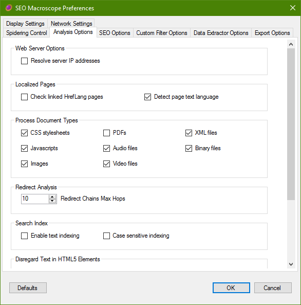

{: .img-responsive .box-shadow}

Set further localization, list processing, and analysis options here.
{: .lead }

## Localized Pages

### Check Linked HrefLang Pages

Enabling this option will perform a simple HEAD request against detected HrefLang tags found in HTML pages.

By itself, this option will not cause SEO Macrosope to recurse into the websites referenced by the HrefLang tags if the referenced websites are considered to be "external."

Enable the *Follow HrefLang Links* option under the *Spidering Control* tab if you would like to also scan the websites referenced by the HrefLang tags.

## List File Processing

### Scan sites in list

Enabling this option will cause SEO Macroscope to recurse into the websites for each URL in the URL list.

Please note that this may take a long time to complete if there are many websites included in the URL list.

Uncheck this option, if you only need to check the exact URLs in the URL list.

## Page Fault Analysis

### Warn about insecure links

Enabling this option will report insecure links to pages or resources from secure pages.

## Levenshtein Edit Distance Processing

In addition to other methods, I have implemented a [Levenshtein Edit Distance](https://en.wikipedia.org/wiki/Levenshtein_distance) approach for attempting to detect near-duplicate content.

What this means is that for each HTML or PDF document that is fetched, the human-readable text is extracted and cleaned into a sanitized format.

By then applying the Levenshtein algorithm, we can discover pages that have text content that is similar to each other, within a certain threshold.

Please note that applying this method may incur a significant overhead, especially on larger crawls.

### Enable Levenshtein Duplicate Detection

Enabling this option will make the Levenshtein Edit Distance algorithm be applied in some areas of the application.

Currently, the comparison data is only available in the duplicate content Excel report.

### Maximum Levenshtein Text Length Difference

This value is used to consider whether to apply the Levenshtein algorithm to two documents, or not.

The value is the difference in byte-lengths between the two texts of the two documents.

If the two documents are within this threshold, then the Levenshtein algorithm is applied, if not, then they are considered to be too different.

### Levenshtein Edit Distance Threshold

Set this value to the maximum number of "edits" that consider the two documents to have very similar texts.
