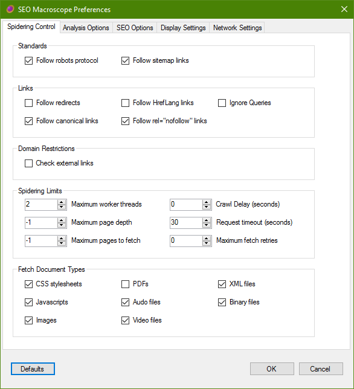

{: .img-responsive .box-shadow}

## Spidering Control

These settings control how SEO Macroscope crawls the links on your site.

### Standards

#### Follow Robots Protocol (Partially implemented)

SEO Macroscope will honour the robots.txt directives, if present. Currently, this includes only those directives for the wildcard user agent.

Currently, on-page robot directives are not implemented.

If present, the *crawl delay* directive will be followed. Please note however that this delay is set per-thread. Which means that if crawling with 4 threads with a delay of 1 second, then your site may receive 4 requests every second. Set the thread count low to begin with.

Also see *Crawl Delay* in the *Spidering Limits* section.

#### Follow Sitemap Links (Partially implemented)

SEO Macroscope will attempt to discover Google Sitemap XML files specified by your website, and follow the links in them.

### Links

#### Follow Redirects

If this option is checked, then SEO Macroscope will log and follow redirects. External URLs will only be logged.

#### Follow Canonical Links

If this option is checked, then SEO Macroscope will log and follow canonical links, if present. External URLs will only be logged.

#### Follow HrefLang Links

If this option is checked, then SEO Macroscope will log and follow HrefLang links in the head section of HTML pages.

Please note that this will also mark localized hosts as being "internal" hosts.

#### Follow rel="nofollow" Links

If this option is checked, then SEO Macroscope will log and follow HTML links that are set to "nofollow", otherwise, those links will not be crawled.

#### Domain Restrictions

#### Check External Links

If this option is checked, then SEO Macroscope will log and follow links that are on external hosts.

Please note, this may result in an infinite crawl, or may take an extremely long time to complete.

Use the include/exclude *Task Parameters* to explicitly specify which external hosts you may potentially like to crawl.

#### Spidering Limits

These options control how aggressive SEO Macroscope is in its crawling.

Set low values to begin with.

#### Maximum Worker Threads

SEO Macroscope uses a threaded model to manage crawler workers.

To be conservative, set the number of threads to 1 initially.

Please note that the thread count combines with the *Crawl Delay*. The *Crawl Delay* applies to each thread, which means that your site may receive a request equal to the number of threads every *Crawl Delay* second(s).

#### Maximum Page Depth

Counting from the website's document root of /, this is the maximum depth that SEO Macroscope will fetch a particular URL.

#### Maximum Pages To Fetch

This is approximately the maximum number of pages that SEO Macroscope will attempt to fetch.

It may fetch slightly more than this number.

#### Crawl Delay (seconds)

This overrides the *Crawl Delay* that may be set by the robots.txt directives for the website.

If set, then SEO Macroscope will pause after fetching each page in each thread for *Crawl Delay* second(s).

#### Request Timeout (seconds)

Set this to how long before SEO Macroscope should wait for a response from the server.

#### Maximum Fetch Retries

Set this to the number of attempts that SEO Macroscope should make when retrieving a page.

If you have a fast web server, then set this to a reasonably low value. Setting it too high may slow down the overall crawl if your web server is slow to respond.

TBD
